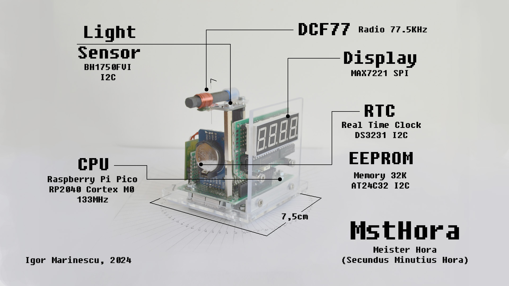

# Meister Hora: The DIY Digital Clock

Introducing Meister Hora (MstHora), a sophisticated and versatile digital clock designed for tech enthusiasts and DIY hobbyists. Powered by the robust Raspberry Pi Pico board, this clock not only shows time but does so with precision and adaptability, making it a standout addition to any room.

## Project Inspiration and Goals

The main goal of the MstHora project was to gather hands-on experience in designing and producing a product from the initial idea to the final functional piece. It embodies the journey of learning and creation, showcasing the blend of electronics, programming, and craftsmanship.

## Key Features

**DCF77 Radio Receiver**: MstHora leverages a DCF77 radio receiver to synchronize time and date with the highly accurate atomic clock signals broadcast from Mainflingen, Germany. This ensures that the clock is always precise, automatically adjusting for daylight saving time changes and other regional time adjustments.

**Real-Time Clock (RTC) Module**: Equipped with a reliable RTC module, MstHora maintains accurate timekeeping even when powered off. This backup feature ensures the clock's reliability, avoiding the need for manual resetting after power interruptions.

**Luminosity Sensor**: MstHora adapts to its environment with an integrated luminosity sensor. The sensor dynamically adjusts the intensity of the 7-segment display, providing optimal visibility whether it's day or night, bright or dim.

**7-Segment Display**: The clear and bright 7-segment 0.56" display makes it easy to read the time. The automatic brightness adjustment ensures that the display is never too harsh or too dim, preserving readability and eye comfort.

**Open-Source Design**: MstHora is entirely open-source, inviting everyone to explore, modify, and improve upon the design. This includes:

1. Software: Written in C, well documented, available for download.
2. Hardware: Detailed hardware schematics and component lists are provided, ensuring you have all the information needed to replicate or customize the project.
3. Mechanical Drawings: Comprehensive mechanical drawings are available, offering a clear blueprint for constructing the physical clock.

**Software**: The software driving MstHora is written in C, offering robust performance and efficient handling of all its functions. Key aspects include:
1. Communication Drivers: Custom-developed drivers handle communication between the Raspberry Pi Pico, the DCF77 receiver, the RTC module, the EEPROM memory and the luminosity sensor, ensuring seamless integration and operation. 
2. Decoding Algorithms: Sophisticated algorithm decodes the DCF77 time signal, converting it into accurate and reliable time data displayed on the 7-segment display.

**Hardware and Build**: MstHora is not just a digital watch, but an attempt to combine engineering and craftsmanship. The mechanical and electrical components are easy to find. No special tools or equipment are required to build this clock.

## Build MstHora

[Bill of materials (notes/bill of materials.md)](./notes/bill%20of%20materials.md) contains the list of all electrical and mechanical parts required to build MstHora.

The *schematics* folder contains all necessary drawings (mechanical, circuit diagrams, electronic routing, assembly) along with self-explanatory instructions.

In the *photos* folder there are some photos available that will help even better understand the construction of the device.

## Compile the Software and program MstHora

Follow the instructions under [notes/how to compile](./notes/how%20to%20compile.md) to get the code, compile it, and load the firmware onto MstHora.

## Time Sources

1. DCF77 Radio Module - receives the exact time every minute (with a good DCF signal).
2. External RTC (DS3231) - accurate and keeps track of time even when turned off.
3. Internal RTC (RP2040) - not accurate and loses time when switched off.

The main source of the current time is the DCF signal. The first backup time source is the external RTC clock, which ensures accurate timekeeping even when the device is turned off. The second backup time source is the internal RTC. It maintains timekeeping in case the two time sources mentioned above are temporarily unavailable, but stops when the device is turned off and is reset when it is turned on.

## Display

The 7 segments display the current time in HH:MM format. The digits flash if the current time has not been validated by the DCF or the external RTC module (no valid time source available).

The rightmost dot indicates the DCF status: permanently ON – the DCF signal is too weak to synchronize the time; flashing – the DCF signal is strong enough, synchronization is in progress; permanently OFF – the DCF time has been successfully received and the time is synchronized.

The second dot from the right indicates the status of the external RTC: permanently ON – the external RTC contains an invalid time; permanently OFF – the external RTC has an accurate time.

The third dot from the right flashes every 1 second.

## First Power-On

On the first run, the external RTC has no valid time and the internal RTC starts counting from 0:00. The time digits are flashing, indicating no valid time source is available. The clock runs on the internal RTC. 

With a good DCF signal, it takes about 5 seconds to receive and validate the current time from the DCF77 module. After reception, the current time is used to set the external RTC and adjust the internal RTC. The time digits no longer flash.

## Second and subsequent Power-On

At the second and all subsequent power-ons, the external RTC already has a valid time - it is temporarily considered the main time source (until the DCF77 module receives the current time). The external RTC time is displayed and the internal RTC is set. The rightmost dot is ON (or flashing) - the DCF signal has not been received yet. After reception, the DCF current time is used to reset the external and internal RTC.

## Luminosity sensor

MstHora adapts to its environment with an integrated luminosity sensor. The sensor constantly measures the brightness of the light in the room and dynamically adjusts the intensity of the 7-segment display. At night, the display is dimmed to the maximum to ensure optimal visibility and not disturb sleep. During the day, the intensity of the 7-segment display is increased according to the brightness of the light - to enable the comfortably reading of the current time.

## Test MstHora

MstHora provides a CLI - Command Line (Serial) Interface. Through this interface, you can simply connect the clock to the PC, open a terminal and execute various commands to test and diagnose all components. The CLI can easily be extended to implement additional functionality.

## Electrical Characteristics

Measurements:

- Current at minimal display intensity: 27mA @ 5V (135mW)
- Current at maximal display intensity: 45mA @ 5V (225mW)

## Expanding MstHora's Functionality and Future Plans

- Alarm clock, control a set of RGB-LEDs mounted in plexiglass.
- Additional sensors (motion detector, microphone) to monitor sleep quality.
- Bluetooth connectivity, alarm settings and sleep quality display.
- SD card slot for collecting data (sleep quality, light sensor, wake/sleep times, etc).
